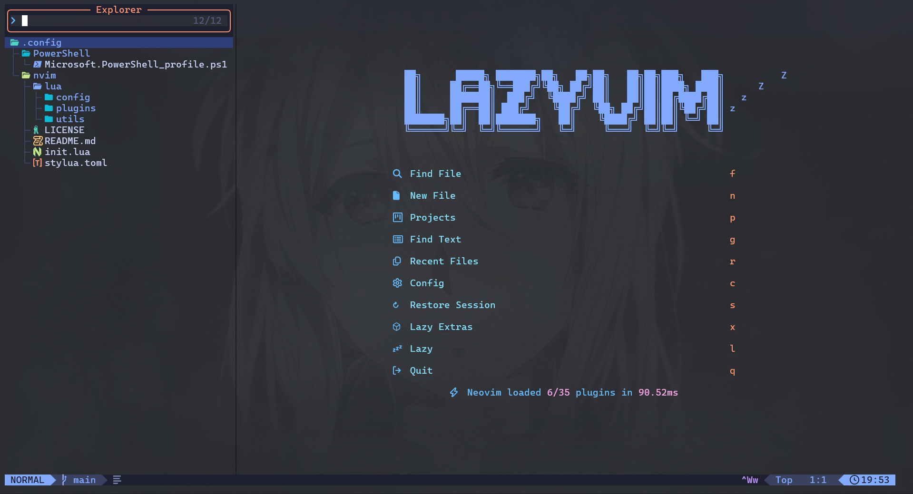

# 💻 Dotfiles 

> Warning: Don’t blindly use these settings unless you understand what they do.
> These configurations are tailored specifically to my personal workflow.
> Apply everything at your own risk and make sure you know what each part affects.

## Neovim Configuration

### Features
- [**LazyVim**](https://www.lazyvim.org/)
- [**Live-Server**](https://www.npmjs.com/package/live-server)

## PowerShell Configuration
### Features

- [**Oh My Posh**](https://ohmyposh.dev/) - Theme (amro)
- [**Terminal Icons**](https://github.com/devblackops/Terminal-Icons)  for better visuals
- [**PSFzf**](https://github.com/kelleyma49/PSFzf) fuzzy finder integration

## Notes

- These configurations are made for my own setup and preferences.
- Do not copy configuration without **fully understanding** it.
- Some settings may behave differently depending on application versions or your system environment.

## Reference

- General documentation
- Several settings are inspired by [craftzdog](https://github.com/craftzdog/dotfiles-public)

